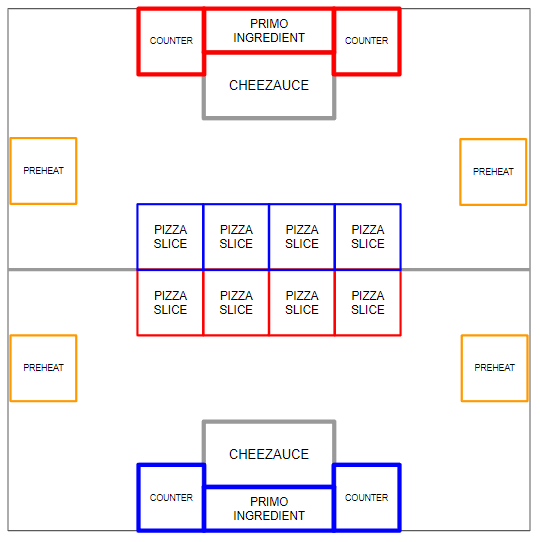
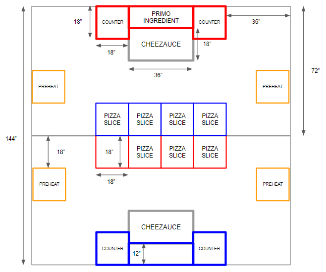
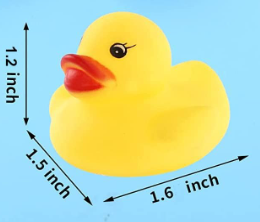
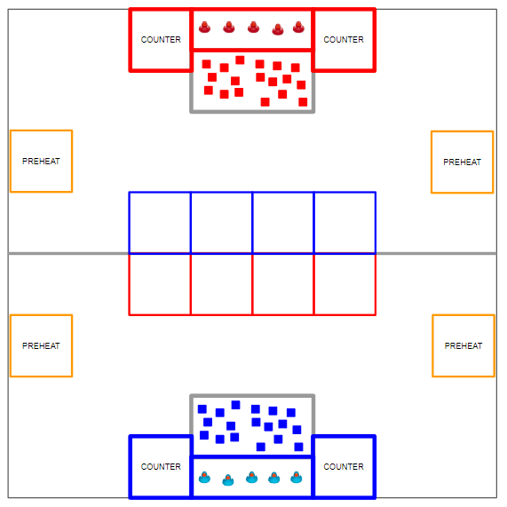
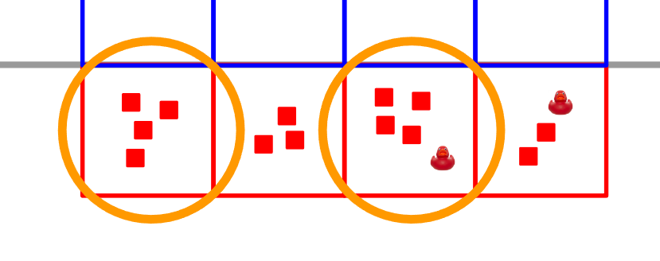
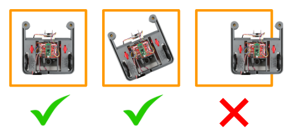
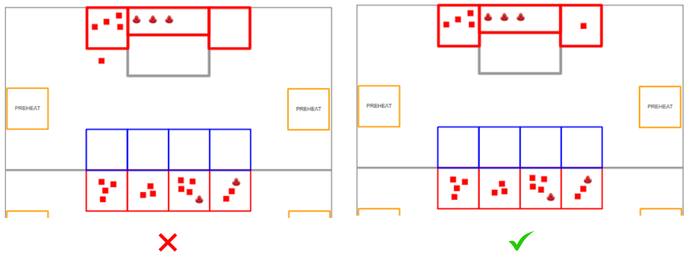

# eXtreme Robot Pizza (XRP) Party

## 1. Game Overview

You and your alliance own a pizza shop run by XRP botos. Your goal every round is to assembly 4 pizza slices with sauce, cheese and optional toppings and place them in the oven. Then get ready for the next customer by cleaning up your kitchen space and returning to the counter for the next customer.

Each match begins with a 15-second autonomous period, during which time alliance robots operate only on pre-programmed instructions to score points by:

* Leaving the counter/home area
* Pre-heating the oven by stopping in the Oven Control zone

In the final 2 minutes and 15 seconds of the match, drivers take control of their robots and score points by:

* Putting ingredients on each of their pizza slices
* Returning to the counter before the end of the match

The alliance with the highest score at the end of the match wins!

## 2. Arena

The ARENA includes all elements of the infrastructure that are required to play XRP Party: The FIELD, GAME PIECES and all other equipment needed for FIELD control, ROBOT control and scorekeeping.

### 2.1 The Field

Each FIELD for XRP Party is a 12ft x 12ft area, bound by the guardrails.

The FIELD is populated with the following elements and areas:
* 4 red PIZZA SLICEs and 4 blue PIZZA SLICEs located in the OVEN zone
* 4 PREHEAT zones (2 in the red area, and 2 in the blue area)
* 2 red COUNTER zones and 2 blue COUNTER zones
* 1 red CHEEZAUCE area and 1 blue CHEEZAUCE zone
* 1 red PRIMO INGREDIENT platform and 1 blue PRIMO INGREDIENT platform
* 1 CENTER LINE dividing the field into red and blue sections

### 2.2 Areas, Zones and Markings

* CENTER LINE: White/Black tape that bisects the length of the field
* PIZZA SLICE: an 18" x 18" infinitely tall volume formed by ALLIANCE colored tape (red or blue)
* PREHEAT zone: an 18" x 18" infinitely tall volume formed by yellow/orange tape
* COUNTER: an 18" x 18" infinitely tall volume formed by ALLIANCE colored tape (red or blue)
* CHEEZAUCE area: a 36" x 18" infinitely tall volume formed with gray tape
* PRIMO INGREDIENT area: a 36" x 12" infinitely tall volume formed by the elevated platform

### 2.3 PRIMO INGREDIENT Area

The PRIMO INGREDIENT area is an elevated platform measuring 36" x 18" by 2" high. The platform is constructed of plywood/cardboard and is attached to the field.

### 2.4 Game Pieces

There are 2 types of GAME PIECES: CHEEZAUCE cubes, and PRIMO INGREDIENT cubes.

#### 2.4.1 CHEEZAUCE Cubes

CHEEZAUCE cubes are foam cubes measuring nominally 1" x 1" x 1". CHEEZAUCE cubes come in 2 colors, matching the ALLIANCE colors. That is, red CHEEZAUCE cubes belong to the red ALLIANCE, and blue CHEEZAUCE cubes belong to the blue ALLIANCE.

#### 2.4.2 PRIMO INGREDIENT "Ducks"

PRIMO INGREDIENT "Ducks" are rubber ducks nominally measuring 1.5" width x 1.6" length x 1.2" height. PRIMO INGREDIENTs come in 2 colors, matching the ALLIANCE colors. That is, red PRIMO INGREDIENTs belong to the red ALLIANCE, and blue PRIMO INGREDIENTs belong to the blue ALLIANCE.

## 3. Match Play

During XRP Party, 2 ALLIANCES (an ALLIANCE is a cooperative of up to 2 XRP robots) play MATCHES, set up and implemented per the details described below.

### 3.1 Setup

#### 3.1.1 Game Pieces

Each ALLIANCE gets 18 CHEEZAUCE cubes and 5 PRIMO INGREDIENT "ducks". ALLIANCES can determine how to stage their ingredients, subject to the following:

* All 18 CHEEZAUCE cubes must be fully contained within the ALLIANCE CHEEZAUCE area
* All 5 PRIMO INGREDIENT ducks must be fully contained within the ALLIANCE PRIMO INGREDIENT area

#### 3.1.2 Robots

Each DRIVE TEAM stages their ROBOT such that it is fully contained within either of their COUNTER areas. There should be at most one ROBOT in each COUNTER.

### 3.2 Autonomous Period

The first phase of each MATCH is 15 seconds long and is called the Autonomous Period (AUTO). During AUTO, ROBOTS operate without any DRIVE TEAM control or input. ROBOTS attempt to exit their COUNTER and PREHEAT their ovens before the end of the phase. There is a 5 second delay between AUTO and TELEOP for scoring purposes.

### 3.3 Teleoperated Period

The second phase of each MATCH is two minutes and fifteen seconds (2:15) and called the Teleoperated Period (TELEOP). During this phase, DRIVERS remotely operate ROBOTS to retrieve and score GAME PIECES.

The last 30 seconds of the MATCH is the END GAME period. During this phase, ROBOTS will CLEAN UP their kitchen areas and PARK at their COUNTER.

### 3.4 Scoring

ALLIANCES are rewarded for accomplishing various actions through the course of a MATCH, including demonstrating MOBILITY, PREHEAT-ing ovens, scoring GAME PIECES on PIZZA SLICES, CLEANING up their kitchen areas, PARKING, and winning or tying MATCHES.

Rewards are granted either via MATCH points or Ranking Points (sometimes abbreviated to RP, which increase the measure used to rank teams in the Qualification Tournament). Such actions, their criteria for completion, and their point values are listed throughout this section.

All scores are assessed and updated throughout the MATCH except as follows:

* assessment of PREHEAT scoring occurs 3 seconds after the ARENA timer displays 0 following AUTO
* assessment of PARKING scoring occurs 3 seconds after the ARENA timer displays 0 following TELEOP

Note: All points are evaluated and scored by humans. Teams are encouraged to make sure that it is obvious and unambiguous that a ROBOT or GAME PIECE has met the criteria.

#### 3.4.1 PIZZA SLICE Scoring

ALLIANCES earn points by scoring GAME PIECES on PIZZA SLICES. There is a maximum number of ingredients that can be on each PIZZA SLICE, as highlighted below:

* Maximum of 4 CHEEZAUCE cubes on each PIZZA SLICE
* Maximum of 1 PRIMO INGREDIENT on each PIZZA SLICE

An ALLIANCE earns 1 SELLABLE SLICE for each PIZZA SLICE that has at least 4 CHEEZAUCE cubes. The circled slices below show examples of SELLABLE SLICES.

#### 3.4.2 PREHEAT Scoring

A ROBOT earns points for its ALLIANCE by helping to PREHEAT its oven during AUTO, as outlined in the section 3.4.4.

A ROBOT is PREHEAT READY if it is fully contained within a PREHEAT area on its ALLIANCE side of the FIELD. See the image below for examples:

If both ALLIANCE ROBOTS are PREHEAT READY, the ALLIANCE receives an additional OVEN PREHEATED bonus.

#### 3.4.3 CLEAN KITCHEN Scoring

An ALLIANCE earns points by having a CLEAN KITCHEN at the end of a MATCH. A CLEAN KITCHEN is defined as an ALLIANCE having all of their GAME PIECES being contained either on their ALLIANCE PIZZA SLICES or in either ALLIANCE COUNTER area. See the image below for examples:

#### 3.4.4 Point Values

Point values for tasks in XRP Party are detailed below:

| Award                | Awarded for...                                                                             | AUTO | TELEOP | Qual. |
|----------------------|--------------------------------------------------------------------------------------------|------|--------|-------|
| **MOBILITY**         | each ROBOT that completely leaves its COUNTER at any point during AUTO                     | 2    |        |       |
| **PREHEAT READY**    | each ROBOT that is completely contained within its PREHEAT area at the end of AUTO         | 6    |        |       |
| **OVEN PREHEATED**   | both ROBOTS in an ALLIANCE being PREHEAT READY                                             | 5    |        |       |
| **CHEEZAUCE**        | each ALLIANCE CHEEZAUCE piece scored in an ALLIANCE PIZZA SLICE (maximum of 4)             |      | 2      |       |
| **PRIMO INGREDIENT** | each ALLIANCE PRIMO INGREDIENT scored in an ALLIANCE PIZZA SLICE (maximum of 1)            |      | 4      |       |
| **SELLABLE SLICE**   | each ALLIANCE PIZZA SLICE that has at least 4 CHEEZAUCE piece                              |      | 4      |       |
| **CLEAN KITCHEN**    | all ALLIANCE GAME PIECES being either on PIZZA SLICES or in ALLIANCE COUNTER areas         |      | 10     |       |
| **PARK**             | each ROBOT that is completely contained within an ALLIANCE COUNTER at the end of the MATCH |      | 5      |       |
| **PROFITABLE**       | At least 3 SELLABLE SLICES                                                                 |      |        | 1 RP  |
| **Tie**              | Completing a MATCH with the same number of MATCH points as your opponent                   |      |        | 1 RP  |
| **Win**              | Completing MATCH with more MATCH points than your opponent                                 |      |        | 2 RP  |

An ALLIANCE can earn up to 3 Ranking Points (RP) per Qualification MATCH. There are no Ranking Points in Playoff MATCHES.

### 3.5 Points awarded to opposing Alliance and Rule Violations

There are some actions which will result in MATCH points being awarded to the opposing ALLIANCE.

| Action          | Description                                   | Points added to opposing ALLIANCE |
|-----------------|-----------------------------------------------|-----------------------------------|
| **TRASH PANDA** | each GAME PIECE in the opposing ALLIANCE area | 1 point per GAME PIECE            |
| **FOUL**        | Varies based on game rules                    | 2 points per infraction           |
| **TECH FOUL**   | Varies based on game rules                    | 6 points per infraction           |

Upon any instance of a rule violation, a FOUL or TECH FOUL will be assessed.

## 4. Game Rules: ROBOTS

### 4.1 ROBOT Restrictions

* Stay in bounds: ROBOTS may not extend outside of the FIELD
    * Violation: FOUL
* Don't extend in multiple directions: ROBOTS may not extend beyond their FRAME PERIMETER in more than one direction
    * Violation: FOUL. TECH FOUL if extending in multiple directions scores a GAME PIECE.

### 4.2 ROBOT to ROBOT Interaction

* 5-count on PINS: ROBOTS may not PIN an opposing ROBOT for more than 5 seconds. A ROBOT is PINNING if it is preventing the movement of an opponent ROBOT by contact.
    * Violation: FOUL, plus an additional TECH FOUL for every 5 seconds in which the situation is not corrected
* Stay out of other ROBOTS: A ROBOT may not use a COMPONENT outside of its FRAME PERIMETER to initiate contact with an opponent ROBOT inside the vertical projection of that opponent ROBOT'S FRAME PERIMETER.
    * Violation: FOUL
* This isn't combat robotics: A ROBOT may not damage or functionally impair an opponent robot in either of the following ways:
    * deliberately, as perceived by a REFEREE
    * regardless of intent, by initiating contact, either directly or transitively, inside the vertical projection of that opponent ROBOT'S FRAME PERIMETER.
    * Violation: TECH FOUL
* Let them bake pizza: During TELEOP, a ROBOT may not contact, either directly or transitively through a GAME PIECE, an opponent ROBOT whose FRAME (either completely or partially) is within their PIZZA SLICE areas, or within their CHEEZAUCE areas.
    * Violation: FOUL per instance

### 4.3 FIELD Interaction

* Stay on your side before TELEOP: Before TELEOP, a ROBOT may not intersect the vertical plane formed by the CENTER LINE
    * Violation: FOUL. If contact with an opponent ROBOT, TECH FOUL
* Do not interfere with opponent GAME PIECES before TELEOP: Before TELEOP, a ROBOT action may not cause GAME PIECES staged on the opposing side of the field to move from their starting locations
    * Violation: TECH FOUL per moved GAME PIECE
* Work on your own PIZZA: ROBOTS are not allowed to enter the infinitely high volume bounded by the opposing ALLIANCE PIZZA SLICES
    * Violation: FOUL per instance

### 4.4 GAME PIECES

* Keep GAME PIECES in bounds: ROBOTS may not intentionally eject GAME PIECES from the FIELD
    * Violation: FOUL per GAME PIECE
* Up to 2 GAME PIECES at a time (except inside the COUNTER, CHEEZAUCE and PRIMO INGREDIENT areas): ROBOTS that are not in partial contact with their COUNTER, CHEEZAUCE or PRIMO INGREDIENT areas may not have CONTROL of more than 2 GAME PIECES, either directly or transitively through other objects.
    * A ROBOT is in CONTROL of a GAME PIECE if:
        * the GAME PIECE is fully supported by the ROBOT
        * the ROBOT is intentionally moving a GAME PIECE to a desired location or in a preferred direction
    * Violation: FOUL per additional GAME PIECES
* No cross-contamination: A ROBOT may not control more than one type of GAME PIECE at a time (except at END GAME). The types of GAME PIECES are:
    * Red CHEEZAUCE cube
    * Blue CHEEZAUCE cube
    * Red PRIMO INGREDIENT
    * Blue PRIMO INGREDIENT
    * Violation: FOUL per different GAME PIECE
